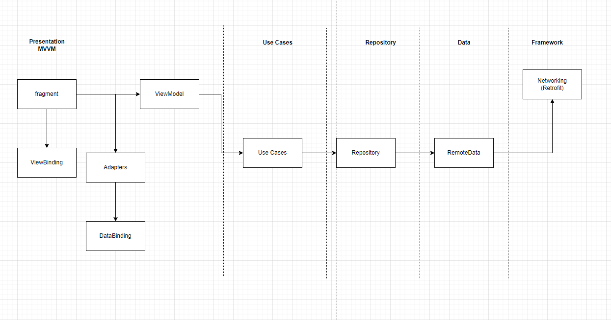

# Architecture Components

## How it looks

    

  

## Architecture  

There are five main layers:  

data: in this module has all details Services 

repository : this responsibility is to sync server data

usecases : this is a layer between view and repository is responsibility to handle the repository requests with coroutines

presentation: This module has all android framework using MVVM

framework: this module separate the external libraries from the other layers, in this case retrofit .

  

## Troubleshooting
  
## API
This project implements Mercado Libre's API. More about in:
https://developers.mercadolibre.com.ar/es_ar/items-y-busquedas
  

## Libraries Used :

* [Navigation Component](https://codelabs.developers.google.com/codelabs/android-navigation/index.html?index=..%2F..index#0)

* [LiveData](https://developer.android.com/topic/libraries/architecture/livedata)

* [ViewModel](https://developer.android.com/topic/libraries/architecture/viewmodel?gclid=Cj0KCQiA4feBBhC9ARIsABp_nbVSzmSdBQuAKP2WhE9fTRDmz2u67AtgL7wFOrs5kgcNKuqHWPbA3mEaAsSJEALw_wcB&gclsrc=aw.ds)

* [Flow](https://developer.android.com/kotlin/coroutines/additional-resources)

* [Data Binding](https://codelabs.developers.google.com/codelabs/android-databinding/index.html?index=..%2F..index#5)

* [View Binding](https://developer.android.com/topic/libraries/view-binding)

* [Retrofit2](https://square.github.io/retrofit/)

* [Coroutines](https://developer.android.com/kotlin/coroutines)

* [Mockk](https://github.com/mockk/mockk)

* [Gradle - DSL ](https://docs.gradle.org/current/userguide/kotlin_dsl.html)

* [Leak Canary](https://github.com/square/leakcanary)

* [Barista](https://github.com/AdevintaSpain/Barista)

* [Dagger Hilt](https://mvnrepository.com/artifact/com.google.dagger/hilt-android)

* [Glide](https://github.com/bumptech/glide) 
